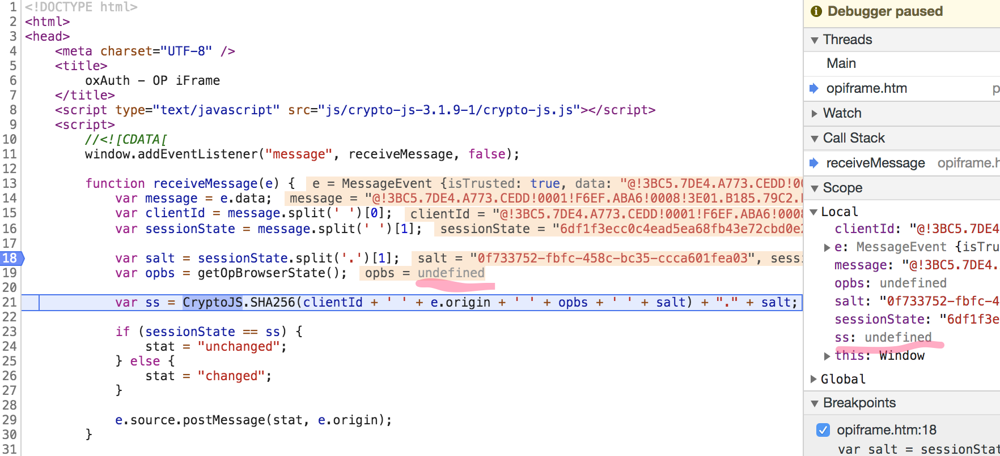
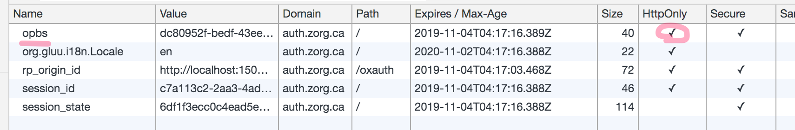
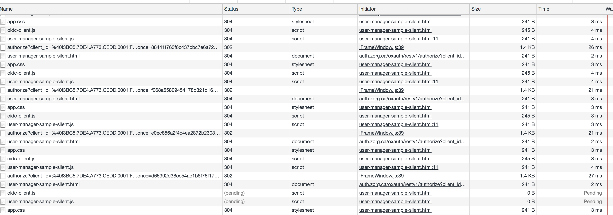
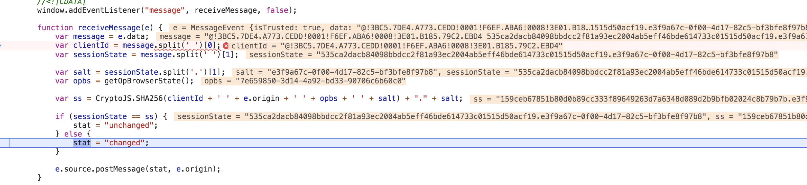

# Bug Report

This repo will explain several bugs discovered in Gluu server, related to session change detection, as defined in [OpenID Connect Session Management 1.0 - draft 28](https://openid.net/specs/openid-connect-session-1_0.html).

It will provide the repro steps, as well as example apps.

Finally, it will provide a solution and a fix submitted in a separate PR.

Note also that the examples have successfully worked with other OIDC server implementations such as IdentityServer, Keycloak and node-oidc-provider.

## Keywords

- session
- session management
- session change detection
- cookies
- session_state
- hash
- multiple clients

## Affected versions

3.1.6, 3.1.6-sp1, 3.1.6-sp2

## Requirements

- Nodejs
- Gluu server 3.1.6 sp1

## Remarks

The nodejs sample clients are copied and adapted from the Vanilla JS sample provided by the oidc-client javascript library:
https://github.com/IdentityModel/oidc-client-js/tree/dev/samples/VanillaJS

# Repro steps

## Provision the clients

Login in Gluu server as an admin and create 2 OIDC clients with the following attributes:

### client1

- **Name:** client1
- **Client ID:** @!3BC5.7DE4.A773.CEDD!0001!F6EF.ABA6!0008!3E01.B185.79C2.EBD4
- **Subject Type:** public
- **Expirattion date:** Fri Sep 22 00:00:00 UTC 2119
- **ClientSecret:** XXXXXXXXXXX
- **Application Type:** web
- **Persist Client Authorizations:** true
- **Pre-Authorization:** true
- **Authentication method for the Token Endpoint:** client_secret_basic
- **Logout Session Required:** false
- **Include Claims In Id Token:** false
- **Disabled:** false
- **Logout Redirect URIs:** [http://localhost:15000/oidc-client-sample.html, http://localhost:15000/user-manager-sample-popup-signout.html, http://localhost:15000/user-manager-sample.html]
- **Login Redirect URIs:** [http://localhost:15000/user-manager-sample-popup-signin.html, http://localhost:15000/user-manager-sample.html, http://localhost:15000/user-manager-sample-silent.html]
- **Scopes:** [email, openid, profile, user_name]
- **Grant types:** [implicit]
- **Response types:** [token, id_token]

### client2

- **Name:** client2
- **Client ID:** @!3BC5.7DE4.A773.CEDD!0001!F6EF.ABA6!0008!CE06.B232.F3C2.8142
- **Subject Type:** public
- **Expirattion date:** Sun Oct 29 00:00:00 UTC 2119
- **ClientSecret:** XXXXXXXXXXX
- **Application Type:** web
- **Persist Client Authorizations:** true
- **Pre-Authorization:** true
- **Authentication method for the Token Endpoint:** client_secret_basic
- **Logout Session Required:** false
- **Include Claims In Id Token:** false
- **Disabled:** false
- **Logout Redirect URIs:** [http://localhost:16000/user-manager-sample.html, http://localhost:16000/user-manager-sample-popup-signout.html]
- **Login Redirect URIs:** [http://localhost:16000/user-manager-sample.html, http://localhost:16000/user-manager-sample-popup-signin.html, http://localhost:16000/user-manager-sample-silent.html]
- **Scopes:** [email, openid, profile, user_name]
- **Grant types:** [implicit]
- **Response types:** [token, id_token]
- **DefaultAcrValues:** [Ljava.lang.String;@22d018c8


## Configure the clients

Edit the following javascript files:
- clients/client1/public/user-manager-sample.js
- clients/client2/public/user-manager-sample.js

The **authority** property should point to your Gluu server and the **client_id** property should match the proper OIDC client that you created in the previous step.


## Start the clients

Open a terminal and execute the following:

```
cd ./clients/client1
npm install
npm start
```

Open a second terminal and execute the following:

```
cd ./clients/client2
npm install
npm start
```

# Bug 1 - opbs cookie misconfigured

There is a bug in the Apache configuration of Gluu server which prevents the opiframe.html to consume the opbs cookie (see opbs is undefined) :



Since the returned 'opbs' cookie has the **HttpOnly** flag set:



As the opbs value is undefined, it will never match the session_state computed by the Gluu server and will always trigger a session change, which will in turn cause a silent refresh and thus flood Gluu server with authorize calls:



Note that if we check the code in oxAuth, in file Server/src/main/java/org/xdi/oxauth/service/SessionIdService.java, we'll find the following method, which explicitely provides a comment in order to justify the absence of the HttpOnly flag:

```
    public void createOPBrowserStateCookie(String opbs, HttpServletResponse httpResponse) {
        // Create the special cookie header with secure flag but not HttpOnly because the opbs
        // needs to be read from the OP iframe using JavaScript
        String header = OP_BROWSER_STATE + "=" + opbs;
        header += "; Path=/";
        header += "; Secure";

        Integer sessionStateLifetime = appConfiguration.getSessionIdLifetime();
        if (sessionStateLifetime != null && sessionStateLifetime > 0) {
            DateFormat formatter = new SimpleDateFormat("E, dd MMM yyyy HH:mm:ss Z");
            Calendar expirationDate = Calendar.getInstance();
            expirationDate.add(Calendar.SECOND, sessionStateLifetime);
            header += "; Expires=" + formatter.format(expirationDate.getTime()) + ";";
        }

        httpResponse.addHeader("Set-Cookie", header);
    }
```

## Repro steps

### Browse client1

Open "http://localhost:15000" in a Browser, click on "UserManager sample".

Click on the "Signin with popup" button

Open "Developer tools" and look at the network activity.

## Fix

Edit the Apache config file:
- Ubuntu: /etc/apache2/sites-available/https_gluu.conf
- Centos: /etc/httpd/conf.d/https_gluu.conf

Find the line:
```
       Header edit Set-Cookie ^((?!session_state).*)$ $1;HttpOnly
````

And replace it with:
```
       Header edit Set-Cookie ^((?!opbs|session_state).*)$ $1;HttpOnly
````
Finally, restart Apache:
```
/etc/init.d/apache2 restart
```

Note that if we don't need the session_state cookie any more (see my last section of questions), then we could simply rename session_state into opbs in https_gluu.conf

# Bug 2 - session_state hash differs from OIDC spec

The second bug is related to the hash generated in the session_state and used for session change detection.

The parts that are hashed by the server are not the same as the ones used by the opiframe.html javascript code.

This will cause opiframe to always detect a session change, which will cause the OIDC library to trigger a silent refresh.

If the detection interval is short (a few seconds), it will generate a lot of requests in the background, forcing Gluu to generate new access tokens.

Network calls in a loop:


opiframe detecting a session change:



## Repro steps

### Browse client1

Open "http://localhost:15000" in a Browser, click on "UserManager sample".

Click on the "Signin with popup" button

Open "Developer tools" and look at the network activity.

## Fix

In file "Server/src/main/java/org/xdi/oxauth/service/SessionIdService.java", method "generateSessionId", the following code will compute the session_state:
```
            final String sessionState = JwtUtil.bytesToHex(JwtUtil.getMessageDigestSHA256(
                    clientId + " " + appConfiguration.getIssuer() + " " + opbs + " " + salt)) + "." + salt;
```

Note that that the second value is "appConfiguration.getIssuer()" which is the hostname of Gluu itself, whereas in the opiframe.html the code will rely on the "e.origin" argument, which should be the hostname of the client (http://localhost:15000):

```
           var ss = CryptoJS.SHA256(clientId + ' ' + e.origin + ' ' + opbs + ' ' + salt) + "." + salt;
```

So, they will never match!!!!

Easy fix:

Since the opiframe.html code matches the OIDC spec https://openid.net/specs/openid-connect-session-1_0.html#OPiframe, we should fix the Java code like this:

```
    private String getClientOrigin(String redirectUri) throws URISyntaxException {
        final URI uri = new URI(redirectUri);
        String result = uri.getScheme() + "://" + uri.getHost();
        if(uri.getPort() > 0)
            result += ":" + Integer.toString(uri.getPort());
        return result;
    }

    private SessionId generateSessionId(String userDn, Date authenticationDate, SessionIdState state, Map<String, String> sessionIdAttributes, boolean persist) {
        try {
            final String sid = UUID.randomUUID().toString();
            final String salt = UUID.randomUUID().toString();
            final String clientId = sessionIdAttributes.get("client_id");
            final String opbs = UUID.randomUUID().toString();
            final String redirectUri = sessionIdAttributes.get("redirect_uri");
            final String clientOrigin = getClientOrigin(redirectUri);
            final String sessionState = JwtUtil.bytesToHex(JwtUtil.getMessageDigestSHA256(
                    clientId + " " + clientOrigin + " " + opbs + " " + salt)) + "." + salt;
        ...
```

Once oxauth has been built and deployed, you can browse client1 (http://localhost:15000), login and verify in the dev tools that there is no network trafic.

Finally, to verify that the session change detection works, you can duplicate the tab, login again, logout in one tab, then when you select the other tab, it should already be logged out.

Note also that IdentityServer implemented it the same way:
https://github.com/IdentityServer/IdentityServer4/blob/1b93a7d6c06905fe3d1f2799e338b5fc1b8be6ab/src/IdentityServer4/src/Extensions/ValidatedAuthorizeRequestExtensions.cs#L99

# Bug 3 - session_state does not support multiple clients

Once the hash encoding is fixed and allows us to use client1 without network side-effects, we will be hit by a third bug also related to the session_state.

This time, this is not related to the hash computation but to the fact that the session_state is only computed once per session, regardless of the number of clients being authorized.

As a consequence, we cannot have 2 separate clients at the same time (either in separate tabs or in the same document), since the second client will always detect a session change and issue a silent refresh, causing the same symptoms than in the previous bugs (too many network calls for obtaining a new access token).

This cannot work of course because the clientId is one of the 4 items that are hashed in order to compute the session_state.
So, the second client will always compute a different hash than the one emitted by Gluu server, which was generated at the time of the initial login.

## Repro steps

### Browse client1

Open "http://localhost:15000" in a Browser, click on "UserManager sample".

Click on the "Signin with popup" button

Open "Developer tools" and look at the network activity.

### Browse client2

Open "http://localhost:16000" in the same Browser but in a separate tab, click on "UserManager sample".

Click on the "Signin with popup" or "sigin with iframe" button

Open "Developer tools" and look at the network activity.

You should see something like this:


## Fix

Since the session_state received by each client is provided through the authorize callback redirect, I thought that we could simply compute it on the fly just before returning the response. That way, it won't change the content of the session, nor the content of the cookies.

I don't know if we need to maintain those values for all clients, or if we can simply generate the values and ignore them.

So, I've slightly changed the following line in :
```
    redirectUriResponse.addResponseParameter(AuthorizeResponseParam.SESSION_STATE, sessionUser.getSessionState());
```

with:
```
    redirectUriResponse.addResponseParameter(AuthorizeResponseParam.SESSION_STATE, sessionIdService.computeSessionState(sessionUser, clientId, redirectUri));
```

And I've added a new method for computing the session_state if the clientId or redirectUri are different from the initial session, in Server/src/main/java/org/xdi/oxauth/service/SessionIdService.java:

```
    public String computeSessionState(SessionId sessionId, String clientId, String redirectUri) {
        final boolean isSameClient = clientId.equals(sessionId.getSessionAttributes().get("client_id")) &&
                redirectUri.equals(sessionId.getSessionAttributes().get("redirect_uri"));
        if(isSameClient)
            return sessionId.getSessionState();
        final String salt = UUID.randomUUID().toString();
        final String opbs = sessionId.getOPBrowserState();
        final String sessionState = computeSessionState(clientId,redirectUri, opbs, salt);
        return sessionState;
    }

    private String computeSessionState(String clientId, String redirectUri, String opbs, String salt) {
        try {
            final String clientOrigin = getClientOrigin(redirectUri);
            final String sessionState = JwtUtil.bytesToHex(JwtUtil.getMessageDigestSHA256(
                    clientId + " " + clientOrigin + " " + opbs + " " + salt)) + "." + salt;
            return sessionState;
        } catch (NoSuchProviderException e) {
            log.error("Failed generating session state! " + e.getMessage(), e);
            throw new RuntimeException(e);
        } catch (NoSuchAlgorithmException e) {
            log.error("Failed generating session state! " + e.getMessage(), e);
            throw new RuntimeException(e);
        } catch (UnsupportedEncodingException e) {
            log.error("Failed generating session state! " + e.getMessage(), e);
            throw new RuntimeException(e);
        } catch (URISyntaxException e) {
            log.error("Failed generating session state! " + e.getMessage(), e);
            throw new RuntimeException(e);
        }
    }

    private String getClientOrigin(String redirectUri) throws URISyntaxException {
        final URI uri = new URI(redirectUri);
        String result = uri.getScheme() + "://" + uri.getHost();
        if(uri.getPort() > 0)
            result += ":" + Integer.toString(uri.getPort());
        return result;
    }

    private SessionId generateSessionId(String userDn, Date authenticationDate, SessionIdState state, Map<String, String> sessionIdAttributes, boolean persist) {
        final String sid = UUID.randomUUID().toString();
        final String salt = UUID.randomUUID().toString();
        final String clientId = sessionIdAttributes.get("client_id");
        final String opbs = UUID.randomUUID().toString();
        final String redirectUri = sessionIdAttributes.get("redirect_uri");
        final String sessionState = computeSessionState(clientId, redirectUri, opbs, salt);
        final String dn = dn(sid);
        sessionIdAttributes.put(OP_BROWSER_STATE, opbs);
        [...]
    }
```


Note that IdentityServer will always generate a new session_state when returning an authorize response:

https://github.com/IdentityServer/IdentityServer4/blob/41f83cd7bf22c87fd4be98df9b8eaefafd80dbc2/src/IdentityServer4/src/ResponseHandling/Default/AuthorizeResponseGenerator.cs#L215

And that it won't use cookies except for the session ID.

# Notes

I have successfully tested the solution in our DEV environment, but I wasn't able to run your unit tests, to verify that I didn't break something else.

I've tested also that it works with:
- a different ACR value (it will force a new Session)
- a second client with "prompt" login and a different user

# Suggestions

## Tests

You should add unit tests and integration tests to make sure that there won't be any regression related to this bug report, since the consequences are pretty disastrous, with the flood of network requests hitting the Gluu server in a loop.

## end_session without active session

When using the allowPostLogoutRedirectWithoutValidation option, if the session was already terminated prior to calling end_session, the logout redirect will have an error parameter, which is not really helpful and is pretty ugly (it contains a very long phrase).
Also, it might cause javascript code to fail if they check this parameter.

So, I would suggest to simply ignore the error, since we can't really act upon it.

See Server/src/main/java/org/xdi/oxauth/session/ws/rs/EndSessionRestWebServiceImpl.java:

```
    private Response createErrorResponse(String postLogoutRedirectUri, EndSessionErrorResponseType error, String reason) {
        log.debug(reason);
        try {
            if (allowPostLogoutRedirect(postLogoutRedirectUri)) {
// Commented out to avoid sending an error:                
//                String separator = postLogoutRedirectUri.contains("?") ? "&" : "?";
//                postLogoutRedirectUri = postLogoutRedirectUri + separator + errorResponseFactory.getErrorAsQueryString(error, "", reason);
                return Response.status(Response.Status.FOUND).location(new URI(postLogoutRedirectUri)).build();
            }
        } catch (URISyntaxException e) {
            log.error("Can't perform redirect", e);
        }
        return Response.status(Response.Status.BAD_REQUEST).entity(errorResponseFactory.errorAsJson(error, reason)).build();
    }
```

# Questions

## Do we really need the session_state cookie?

I have the feeling that it's not used and that it shouldn't be used since it would contain only one of the generated session_state values.

If we keep it, shouldn't we at least remove its HttpOnly flag?
